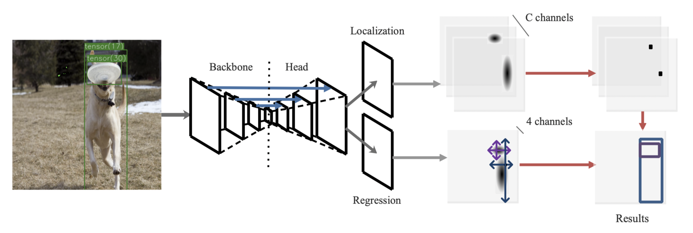
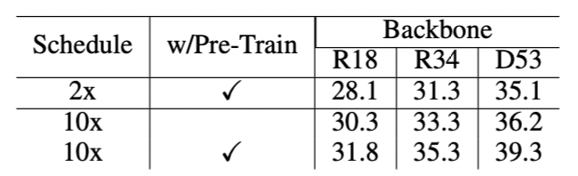

# Training-Time-Friendly Network for Real-Time Object Detection 

The code for implementing the **[TTFNet](https://arxiv.org/abs/1909.00700)** (Accepted to AAAI2020). 



## Highlights
- **Simple:** Anchor-free, single-stage, light-head, no time-consuming post-processing. TTFNet only requires two detection heads for object localization and size regression, respectively.
- **Training Time Friendly:**  Our TTFNet outperforms a range of real-time detectors while suppressing them in training time. Moreover, super-fast TTFNet-18 and TTFNet-53 can reach 25.9 AP / 112 FPS only after 2 hours and 32.9 AP / 55 FPS after about 3 hours on the MS COCO dataset using 8 GTX 1080Ti.
- **Fast and Precise:** Our TTFNet-18/34/53 can achieve 28.1AP / 112FPS, 31.3AP / 87FPS, and 35.1AP / 54 FPS on 1 GTX 1080Ti.

## Performances



TT stands for training time. * indicates that the result is not presented in the original paper. *fast* stands for the super-fast version and *10x* stands for the long-training version. 

All the training time is measured on 8 GTX 1080Ti, and all the inference speed is measured using converged models on 1 GTX 1080Ti. Note that the training time does not include the time consumed by evaluation.


## Installation
Our TTFNet is based on [mmdetection](https://github.com/open-mmlab/mmdetection). Please check [INSTALL.md](INSTALL.md) for installation instructions, and you may want to see the original [README.md](MMDETECTION_README.md). We will submit a pull request soon. 

Note that the darknet part was transplanted (i.e., MXNet => Pytorch) from another toolbox [Gluoncv](https://github.com/dmlc/gluon-cv). In addition, portions of the code are borrowed from [CornerNet](https://github.com/princeton-vl/CornerNet) and [CenterNet](https://github.com/xingyizhou/CenterNet). Thanks for their work !

## Inference

We provide the following converged models. 

| Model                       | Training Hours | FPS   | AP(minival) | Link                                                         |
| --------------------------- | -------------- | ----- | ----------- | ------------------------------------------------------------ |
| TTFNet-18 (1x)              | 1.8            | 112.2 | 25.9        | [Download](http://downloads.zjulearning.org.cn/ttfnet/ttfnet18_1x-fe6884.pth) |
| TTFNet-18 (2x)              | 3.6            | 112.3 | 28.1        | [Download](http://downloads.zjulearning.org.cn/ttfnet/ttfnet18_2x-37373a.pth) |
| TTFNet-18 (no-pretrain 10x) | -              | 121.0 | 30.3        | [Download](http://downloads.zjulearning.org.cn/ttfnet/ttf18_scratch_aug_10x-4dd327cf.pth) |
| TTFNet-18 (10x)             | -              | 113.6 | 31.8        | [Download](http://downloads.zjulearning.org.cn/ttfnet/ttf18_aug_10x-0c5709be.pth) |
| TTFNet-34 (2x)              | 4.1            | 86.6  | 31.3        | [Download](http://downloads.zjulearning.org.cn/ttfnet/ttfnet34_2x-0577d0.pth) |
| TTFNet-34 (no-pretrain 10x) | -              | 89.2  | 33.2        | [Download](http://downloads.zjulearning.org.cn/ttfnet/ttf34_scratch_aug_10x-da045e42.pth) |
| TTFNet-34 (10x)             | -              | 88.4  | 35.3        | [Download](http://downloads.zjulearning.org.cn/ttfnet/ttf34_aug_10x-b394ba77.pth) |
| TTFNet-53 (1x)              | 3.1            | 54.8  | 32.9        | [Download](http://downloads.zjulearning.org.cn/ttfnet/ttfnet53_1x-4811e4.pth) |
| TTFNet-53 (2x)              | 6.1            | 54.4  | 35.1        | [Download](http://downloads.zjulearning.org.cn/ttfnet/ttfnet53_2x-b381dd.pth) |
| TTFNet-53 (no-pretrain 10x) | -              | 57.2  | 36.2        | [Download](http://downloads.zjulearning.org.cn/ttfnet/ttf53_scratch_aug_10x-56878a40.pth) |
| TTFNet-53 (10x)             | 30.6           | 57.0  | 39.3        | [Download](http://downloads.zjulearning.org.cn/ttfnet/ttf53_aug_10x-86c43dd3.pth) |

We also provide the pretrained [Darknet53](http://downloads.zjulearning.org.cn/ttfnet/darknet53_pretrain-9ec35d.pth) and [DLA-34](http://downloads.zjulearning.org.cn/ttfnet/dla34-ba72cf86.pth) here. 

The following command will evaluate converged TTFNet-53 on 8 GPUs:

```
./tools/dist_test.sh configs/ttfnet/ttfnet_d53_2x.py /path/to/the/checkpoint 8
```

## Training

The following commands will train TTFNet-18 on 8 GPUs for 24 epochs and TTFNet-53 on 8 GPUs for 12 epochs:

```
./tools/dist_train.sh configs/ttfnet/ttfnet_r18_2x.py 8
```

```
./tools/dist_train.sh configs/ttfnet/ttfnet_d53_1x.py 8
```

## Citations

Please consider citing our paper in your publications if the project helps your research. BibTeX reference is as follows.
```
@article{liu2019training,
  title   = {Training-Time-Friendly Network for Real-Time Object Detection},
  author  = {Zili Liu, Tu Zheng, Guodong Xu, Zheng Yang, Haifeng Liu, Deng Cai},
  journal = {arXiv preprint arXiv:1909.00700},
  year    = {2019}
}
```
