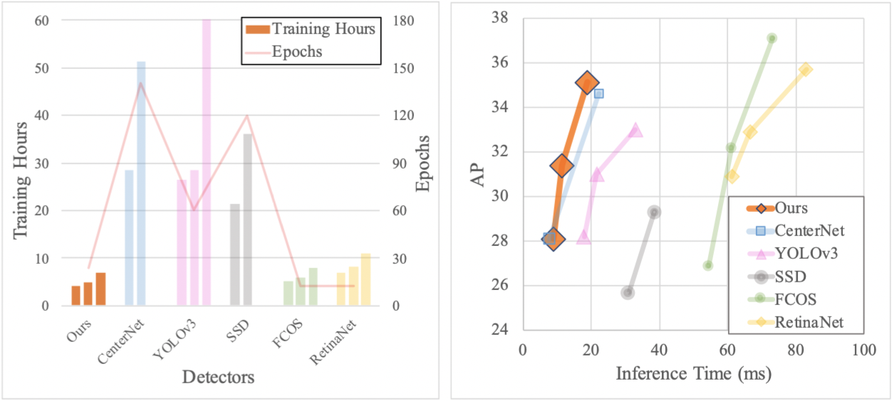
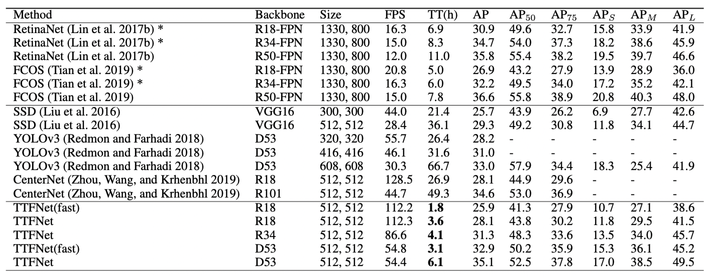

# Training-Time-Friendly Network for Real-Time Object Detection 

The code for implementing the **TTFNet**. 


## Highlights
- **Simple:** Anchor-free, single-stage, light-head, no time-consuming post-processing. TTFNet only requires two detection heads for object localization and size regression, respectively.
- **Training Time Friendly:**  Our TTFNet outperforms a range of real-time detectors while suppressing them in training time. Moreover, super-fast TTFNet-18 and TTFNet-53 can reach 25.9 AP / 112 FPS only after 2 hours and 32.9 AP / 55 FPS after about 3 hours on the MS COCO dataset using 8 GTX 1080Ti.
- **Fast and Precise:** Our TTFNet-18/34/53 can achieve 27.9AP / 112FPS, 31.3AP / 87FPS, and 35.1AP / 54 FPS on 1 GTX 1080Ti.

## Performances





TT stands for training time. * indicates that the model is not presented in the original paper, but we list these results to explore the performances of these work when adopting a light backbone network. All the training time is measured on 8 GTX 1080Ti, and all the inference speed is measured using converged models on 1 GTX 1080Ti. Note that the training time does not include the time consumed by evaluation.


## Installation
Our TTFNet is based on [mmdetection](https://github.com/open-mmlab/mmdetection). We will submit a pull request soon. 

Please check [INSTALL.md](INSTALL.md) for installation instructions, and you may want to see the original [README.md](MMDETECTION_README.md), and .

## Inference

We provide the following converged models. 

| Model          | Training Hours | FPS   | AP(minival) | Link                                                         |
| -------------- | -------------- | ----- | ----------- | ------------------------------------------------------------ |
| TTFNet-18 (1x) | 1.8            | 112.2 | 25.9        | [Download](https://zjueducn-my.sharepoint.com/:u:/g/personal/11921047_zju_edu_cn/EaCB-TKnqURNoyl_P-uxClABsSz35Nmu-L1T3SObBnHYMw?e=HxGXPE) |
| TTFNet-18 (2x) | 3.6            | 112.3 | 28.1        | [Download](https://zjueducn-my.sharepoint.com/:u:/g/personal/11921047_zju_edu_cn/Ef2CVhUYfOJDjzrlQfZGWxwBvUqnXu3mJ0pweiSEuPNYag?e=iJwPPv) |
| TTFNet-34 (2x) | 4.1            | 86.6  | 31.3        | [Download](https://zjueducn-my.sharepoint.com/:u:/g/personal/11921047_zju_edu_cn/Eb0Ab71mpsFBvBP2_GsJ4tUBRGM8NvAym9qZxPqJGtyWSA?e=6Y7BU7) |
| TTFNet-53 (1x) | 3.1            | 54.8  | 32.9        | [Download](https://zjueducn-my.sharepoint.com/:u:/g/personal/11921047_zju_edu_cn/EZVE_d6oR_VGrDD4IZS2ppIB0lm2V8UaBkgFUjuEM7oRZA?e=XVLRwx) |
| TTFNet-53 (2x) | 6.1            | 54.4  | 35.1        | [Download](https://zjueducn-my.sharepoint.com/:u:/g/personal/11921047_zju_edu_cn/Ed1Qxlom3FpGmNZI9dnHau8BtXF0rPeHSYGn6HkoXOEB3A?e=NfPjrZ) |

We also provide the pretrained [Darknet53](https://zjueducn-my.sharepoint.com/:u:/g/personal/11921047_zju_edu_cn/EaXXohf5LgBNji6bkxrARN4BZ9N4sEedaINPeqexu5l2jA?e=nJhe8L) here. Note that the darknet part was transplanted (i.e., MXNet => Pytorch) from another toolbox [Gluoncv](https://github.com/dmlc/gluon-cv). Thanks for their work !

The following command will evaluate converged TTFNet-53 on 8 GPUs:

```
./tools/dist_test.sh configs/ttfnet/ttfnet_d53_2x.py /path/to/the/checkpoint 8
```

## Training

The following commands will train TTFNet-18 on 8 GPUs for 24 epochs and TTFNet-53 on 8 GPUs for 12 epochs:

```
./tools/dist_train.sh configs/ttfnet/ttfnet_r18_2x.py 8
```

```
./tools/dist_train.sh configs/ttfnet/ttfnet_d53_1x.py 8
```

## Citations
Please consider citing our paper in your publications if the project helps your research. BibTeX reference is as follows.
```

```

Thanks for the work of mmdetection toolbox. Their BibTeX reference is as follows.
```
@article{mmdetection,
  title   = {{MMDetection}: Open MMLab Detection Toolbox and Benchmark},
  author  = {Kai Chen, Jiaqi Wang, Jiangmiao Pang, Yuhang Cao, Yu Xiong, Xiaoxiao Li,
             Shuyang Sun, Wansen Feng, Ziwei Liu, Jiarui Xu, Zheng Zhang, Dazhi Cheng,
             Chenchen Zhu, Tianheng Cheng, Qijie Zhao, Buyu Li, Xin Lu, Rui Zhu, Yue Wu,
             Jifeng Dai, Jingdong Wang, Jianping Shi, Wanli Ouyang, Chen Change Loy, Dahua Lin},
  journal = {arXiv preprint arXiv:1906.07155},
  year    = {2019}
}
```
